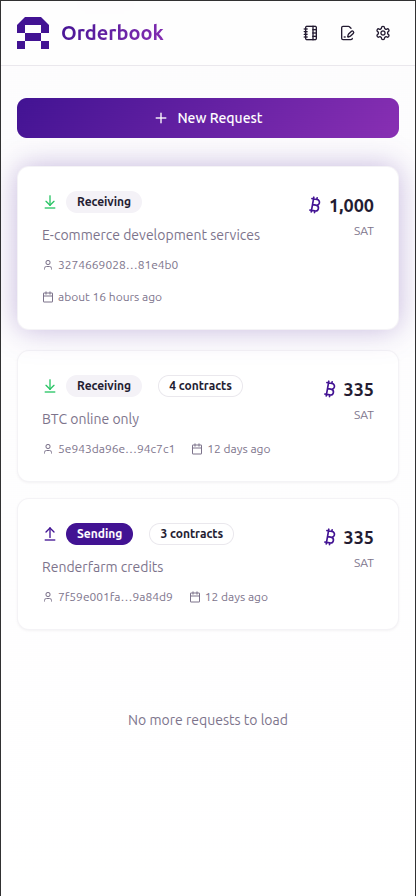
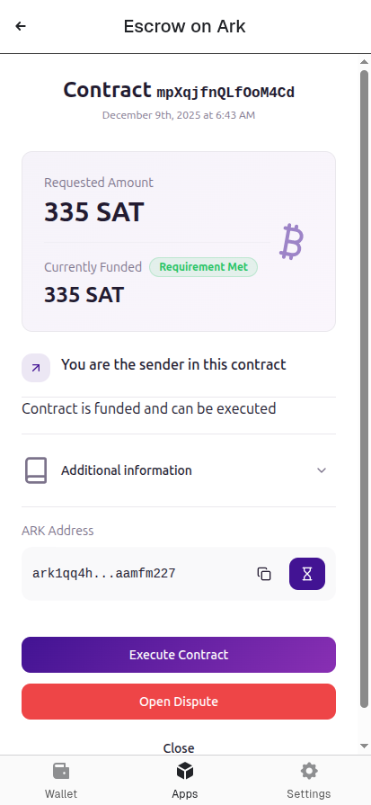
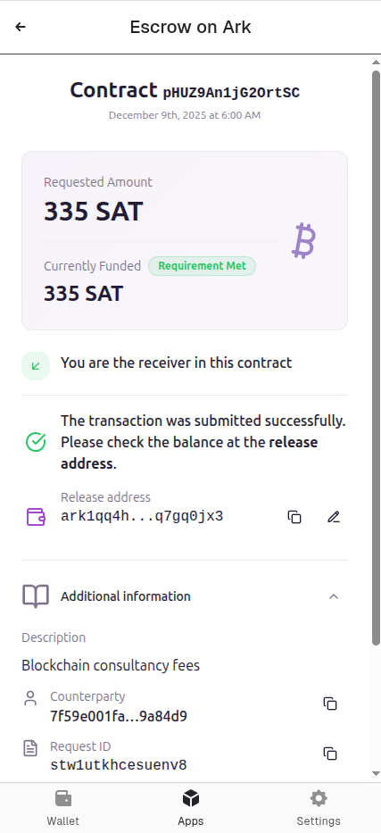

# 👾 Arkade Escrow

**Arkade Escrow** is a lightweight, browser-native escrow platform for instant, trust-minimized Bitcoin deals on Ark—deployable as a **standalone web app** or seamlessly **embedded inside any Ark-enabled wallet** via iframe.

Built around a **2-of-3 multisig design** (Sender, Receiver, Arbitrator) and powered by the open-source ARK protocol, it lets anyone create, join, fund, and settle escrows with fast, off-chain VTXO pre-confirmations and batched, fee-efficient on-chain settlement.

Escrows form through contracts: one party initiates, the counterparty accepts, and a deterministic Ark address is derived—ready for funding from on-chain Bitcoin.

Release and refund flows are coordinated through partially signed transactions, with co-signing handled directly in the browser or by the host wallet. In case of disputes, the arbitration server can finalize via time-locked Arb+party paths while enforcing configurable service fees and maintaining an auditable event log.

Designed for performance, clarity, and usability, Arkade Escrow provides a polished dashboard for managing active and past escrows, real-time updates, and a minimal built-in wallet for send/receive when running standalone. Whether embedded inside a full wallet or spun up as an ephemeral, single-use signer, it delivers a secure, beginner-friendly path to trust-minimized Bitcoin escrow with no accounts, no custodians, and no friction.


## Screenshots

| Standalone (Orderbook)                                                              | Hosted (Contract funded)                                                                 | Hosted (Contract completed)                                                            |
|-------------------------------------------------------------------------------------|------------------------------------------------------------------------------------------|----------------------------------------------------------------------------------------|
|  |  |  |


## Environment Variables

### API Server
Found in `./server/.env`

| Variable                    | Description                                                     | Example Value                                                                          |
| --------------------------- |-----------------------------------------------------------------|----------------------------------------------------------------------------------------|
| `JWT_SECRET`           | Secret to sign the JWT                                          | `JWT_SECRET=161a40a6e029a45beb8459f0f5f5a95f66d8`                                      |
| `PORT`                      | Port to run the server on                                       | `PORT=3002`                                                                            |
| `NODE_ENV`                  | Environment to run the server in (development, production, test) | `NODE_ENV=development`                                                                 |
| `SQLITE_DB_PATH`            | Path to the SQLite database file                                | `SQLITE_DB_PATH=./data/db.sqlite`                                                      |
| `ARBITRATOR_PUB_KEY`        | Public key of the Arbitrator (hex)                              | `ARBITRATOR_PUB_KEY=86f5d11162ab25c88f4af9cc4224161a40a6e029a45beb8459f0f5f5a95f66d8`  |
| `ARBITRATOR_PRIV_KEY`       | Private key of the Arbitrator (hex)                             | `ARBITRATOR_PRIV_KEY=62325754772ad366d149517311d5fe5cbccb4746ef0285c393ff67f0ad62dd87` |
| `ARK_SERVER_URL`            | URL of the Ark server to use (e.g. `http://localhost:7070`)     | `ARK_SERVER_URL=http://localhost:7070`                                                 |
| `BACKOFFICE_BASIC_USER`      | Basic auth username for the Backoffice API (optional)           | `BACKOFFICE_BASIC_USER=operator`                                                       |
| `BACKOFFICE_BASIC_PASS`      | Basic auth password for the Backoffice API (optional)           | `BACKOFFICE_BASIC_PASS=aPassword`                                                      |
| `SHARE_BASE_URL`      | The URL to be used for creating "share request" link            | `SHARE_BASE_URL=http://localhost:3001/client/requests/`                                                                   |

### Client
Found in `./client/.env`

| Variable                    | Description                                          | Example Value                                                                          |
| --------------------------- |------------------------------------------------------|----------------------------------------------------------------------------------------| 
| `VITE_API_BASE_URL`         | Base URL of the API endpoints     | `VITE_API_BASE_URL=http://localhost:3002/api/v1`                                         |
| `VITE_APP_ROOT_URL`          | Root URL of the client app (e.g. `/client`)          | `VITE_APP_ROOT_URL=/client`                                                            |
| `VITE_ITEMS_PER_PAGE`        | Default page size for the UI                         | `VITE_ITEMS_PER_PAGE=20`                                                               |


### Backoffice
Found in `./backoffice/.env`

| Variable                    | Description                                          | Example Value                                                                          |
| --------------------------- |------------------------------------------------------|----------------------------------------------------------------------------------------| 
| `VITE_API_BASE_URL`         | Base URL of the API endpoints     | `VITE_API_BASE_URL=http://localhost:3002/api/v1`                                         |
| `VITE_APP_ROOT_URL`          | Root URL of the client app (e.g. `/client`)          | `VITE_APP_ROOT_URL=/backoffice`                                                          |
| `VITE_ITEMS_PER_PAGE`        | Default page size for the UI                         | `VITE_ITEMS_PER_PAGE=20`                                                               |


## Getting Started

### Prerequisites
- Node.js >=20 
- NPM >= 10

There is a `.tool-versions` file in the root of the project for use with [asdf](https://github.com/asdf-vm/asdf) or [mise](https://mise.jdx.dev/).

### Installation

Install dependencies

```bash
npm install
```

## Development

The DB is under `data/db.sqlite`

Using the commands below the page will reload if you make edits.\
You will also see any lint and type errors in the console.


### `npm run dev`

Runs the three apps in the development mode.\
The server runs by default on port `3002` and the frontend is served as a static website.

Open [localhost:3002/api/v1/docs](localhost:3002/api/v1/docs) to open the Swagger UI, 
[http://localhost:3002/client/](http://localhost:3002/client/) to open the client app and
[http://localhost:3002/backoffice/](http://localhost:3002/backoffice/) to open the backoffice app.

The DB is under `data/db.sqlite`

The page will reload if you make edits.\
You will also see any lint and type errors in the console.


### `npm run dev:api`

Runs the API server in the development mode.\
The server runs by default on port `3002`.

Open [localhost:3002/api/v1/docs](localhost:3002/api/v1/docs) to open the Swagger UI.


### `npm run dev:client`

Runs the Client app in the development mode.\
The server runs by default on port `3001` and the frontend is served at 
[http://localhost:3001](http://localhost:3001).

### `npm run dev:backoffice`

Runs the Client app in the development mode.\
The server runs by default on port `8080` and the frontend is served at
[http://localhost:8080](http://localhost:8080).

### `npm run test`

Runs all the tests, including E2E tests (requires [Nigiri](https://github.com/vulpemventures/nigiri/))


## With Docker

Start the server:

```
$ make up 
```

- The server runs by default on port `3002`.
- Swagger is available at `localhost:3002/api/v1/docs`.
- Client and Backoffice apps are served under `/client` and `/backoffice` respectively.
- The DB is under `data/db.sqlite`

Stop the server:
```
$ make down
```


# Repository structure

This monorepo-like includes three apps:
- **API** - the API server (under `./server`) 
- **Client** - the static web app to be hosted in a wallet provider like https://arkade.money/ (under `./client`) or can run standalone 
- **Backoffice** - the static admin panel to manage escrows and arbitrations (under `./backoffice`) 

## Stack
- [NodeJS](https://nodejs.org/en/) latest stable (24)
- [TypeScript](https://www.typescriptlang.org/)
- [NestJS](https://docs.nestjs.com) - opinionated API framework with DI, for quick scaffolding and easy testing
- [SQLite](https://sqlite.org/) - for the POC, we may consider other options for production
- [Noble cryptography](https://paulmillr.com/noble/)
- [Biome.js](https://biomejs.dev/) instead of Prettier/ESLint, it's faster
- [Jest](https://jestjs.io/) test framework
- [TypeORM](https://typeorm.io/#/) - mostly because it has great NestJS integration
- [React](https://react.dev/) - UI framework
- [Tailwind](https://react.dev/) - CSS framework

